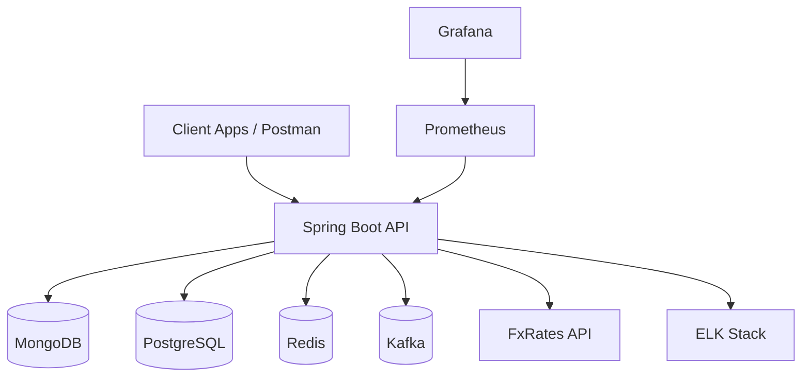
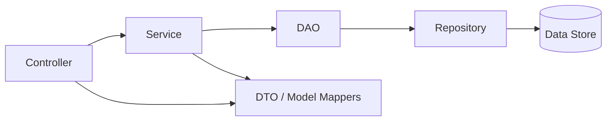
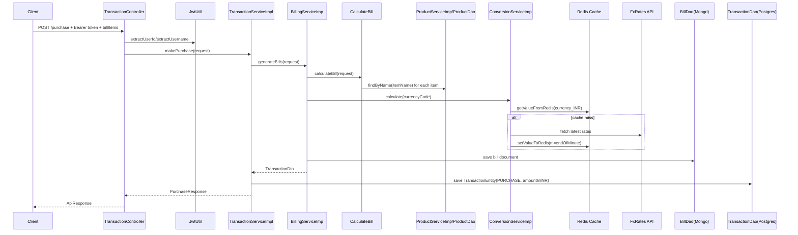
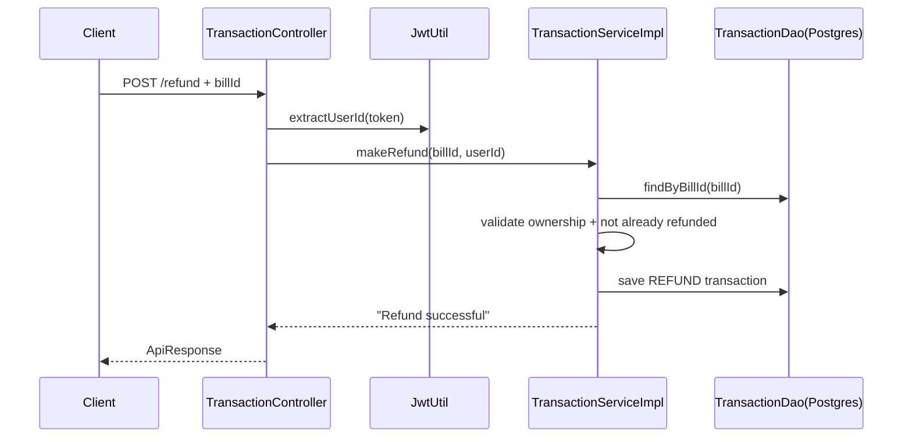
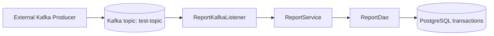
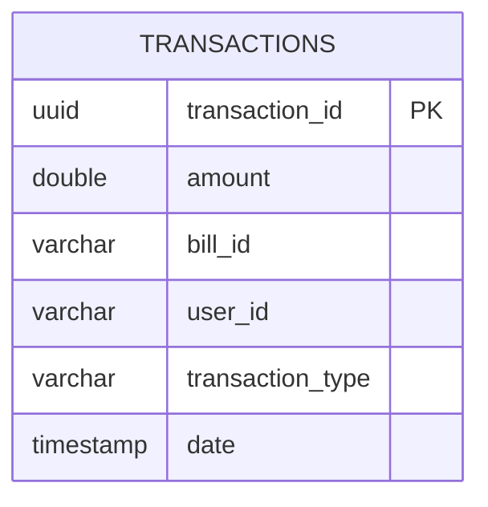

# Kirana Store Backend Architecture

## 1. Document Purpose

This document explains the architecture of the Kirana Store backend in a way that is useful for both:

- beginners (to understand what each part does),
- experienced backend engineers (to evaluate design quality, tradeoffs, and scalability).

It combines:

- HLD (High-Level Design),
- LLD (Low-Level Design),
- current implementation behavior,
- recommended production-grade improvements.

## 2. Problem and Domain Context

The system is a transaction-register backend for Kirana stores. Core domain needs:

1. Track purchases and refunds.
2. Handle currency conversion.
3. Maintain transaction ledger for reporting.
4. Support user authentication/authorization.
5. Protect APIs with rate limiting.
6. Scale for concurrent usage while preserving data integrity.

## 3. High-Level Design (HLD)

### 3.1 Container-Level View



### 3.2 Why Polyglot Persistence Here

- PostgreSQL stores `transactions` ledger because:
  - strong relational consistency is useful for financial history,
  - date-range reporting queries are straightforward.
- MongoDB stores `users`, `products`, `bills`, `refresh_tokens` because:
  - document structure maps naturally for flexible payloads (bill items, user roles),
  - developer velocity is high for CRUD-oriented features.
- Redis is used for:
  - low-latency cache (FX conversion values),
  - a natural extension point for distributed rate limiting and locking.

## 4. Layered Architecture and MVC

The code follows a layered approach with MVC style endpoint handling:



### 4.1 MVC Mapping in Current Code

- **Controller (presentation/API layer)**:
  - `feature_users/controllers/UserController`
  - `feature_products/controllers/ProductController`
  - `feature_transactions/controllers/TransactionController`
  - `auth/controller/RefreshController`
- **Service (business logic layer)**:
  - `UserServiceImp`, `AuthServiceImp`, `ProductServiceImp`,
  - `BillingServiceImp`, `TransactionServiceImpl`, `ConversionServiceImp`, `ReportService`.
- **Model/DTO layer**:
  - request/response DTOs (`UserRequest`, `PurchaseRequest`, `PurchaseResponse`, etc.),
  - utility mappers (`UserDtoUtil`, `ProductDtoUtil`, `BillDtoUtil`, `TransactionDtoUtil`).
- **DAO layer**:
  - `UserDAO`, `ProductDao`, `BillDao`, `TransactionDao`, `RefreshTokenDAO`, `ReportDao`.
- **Persistence/repository layer**:
  - Spring Data repositories for MongoDB/JPA.

### 4.2 DTO and DAO Concepts (Beginner-Friendly)

- **DTO (Data Transfer Object)**:
  - Used to transfer data across layers or over API boundary.
  - Example: `PurchaseRequest` receives client input; `PurchaseResponse` sends output.
  - Benefit: avoid exposing persistence entities directly.

- **DAO (Data Access Object)**:
  - Encapsulates data retrieval/write operations.
  - Example: `TransactionDao.findByBillId`, `ProductDao.findByType`.
  - Benefit: service layer stays focused on business rules, not query plumbing.

## 5. Domain Flows (LLD)

### 5.1 Purchase Flow



### 5.2 Refund Flow



### 5.3 Reporting Flow (Async Trigger)



The current implementation prints report results to console rather than exposing report endpoints.

## 6. Security Design

### 6.1 Authentication and Authorization

- Login uses `AuthenticationManager` + `CustomUserDetailsService`.
- Access token:
  - generated by `JwtUtil`,
  - includes `roles`, `userId`, `sessionId`,
  - expires in 5 minutes.
- Refresh token:
  - persisted in MongoDB (`RefreshToken` document),
  - expiry set to 15 minutes.
- Route protection:
  - `SecurityConfig` permits `/login`, `/register`, `/actuator/**`,
  - all other routes require authentication.
- Role-based auth:
  - `@PreAuthorize("hasRole('ADMIN')")` on product create route.

### 6.2 Security Caveats in Current Implementation

1. Refresh token verification uses BCrypt hash equality incorrectly:
   - BCrypt hashes are salted; encoding same plaintext again produces different hash.
   - Compare should use `encoder.matches(rawToken, storedHash)`.
2. Token secret is hardcoded in constants (should come from secure env/secret manager).
3. Error payload consistency can be improved in filters and exception handlers.

## 7. Rate Limiting Architecture

Current code has two mechanisms:

1. **Global filter-based limiter** (`RateLimiterFilter`)
   - one in-memory token bucket (~100 req/min for all requests on this app instance).
2. **Method-level limiter via AOP** (`@RateLimiter` + `RateLimiterAspect`)
   - per-method in-memory buckets, e.g., login and product listing.

### 7.1 Current Limiter Tradeoffs

- Simple and easy to add.
- Not distributed:
  - limits reset per instance; horizontal scaling breaks strict global limits.
- No user/IP granularity in global filter.

### 7.2 Recommended Distributed Limiter Design

Use Redis-backed bucket per key, where key can be:

- `userId + route`,
- IP + route for anonymous routes.

For Bucket4j, use Redis proxy manager and define refill policy centrally. This gives consistent limits across all app instances.

## 8. Datastore Design and Schema

## 8.1 PostgreSQL (Relational Ledger)

Table: `transactions`



### Why SQL here

- Financial ledger-like data benefits from:
  - deterministic query semantics,
  - transactional writes,
  - indexed range scans for reports.

## 8.2 MongoDB (Document Model)

Collections:

- `users`: account identity + roles.
- `products`: catalog documents.
- `bills`: purchased items, user-selected currency, bill totals.
- `refreshToken` collection (default naming from `@Document` without explicit collection).

```mermaid
erDiagram
    USERS {
        string id PK
        string username
        string password
        string[] roles
    }
    PRODUCTS {
        string id PK
        string name UNIQUE
        string type
        double price
        string date
    }
    BILLS {
        string billId PK
        string userId
        double totalAmount
        string currencyCode
        date billDate
        object[] billItems
    }
    REFRESH_TOKENS {
        string id PK
        string token UNIQUE
        string userId INDEX
        date timeout
        date createdAt
    }
```

### Why NoSQL here

- Bills naturally embed `billItems` arrays.
- Product and user objects can evolve with fewer migration constraints.

## 8.3 SQL vs NoSQL: Key Tradeoffs

| Dimension | PostgreSQL | MongoDB |
|---|---|---|
| Strength | ACID, joins, strong consistency query model | Flexible schema, nested documents, rapid iteration |
| Best used for in this project | immutable transaction ledger + date reports | users/products/bills/session-like docs |
| Risk | migration overhead for shape changes | weaker relational constraints across collections |
| Mitigation | migration tooling + transactional boundaries | validation rules, indexes, and service-level invariants |

## 8.4 Redis Usage

Current usage:

- FX rate cache key: `<CURRENCY>_INR`.
- TTL: remaining milliseconds to end-of-minute.

Recommended expanded usage:

- distributed rate limiting keys,
- distributed locks,
- idempotency keys for purchase/refund APIs.

## 9. Transactionality, Atomicity, and Race Conditions

### 9.1 Current Behavior

`@Transactional` is present on service methods in `TransactionServiceImpl`, but purchase flow spans:

- MongoDB write (`BillDao.save`) and
- PostgreSQL write (`TransactionDao.save`).

These are not part of one distributed transaction by default.

### 9.2 Consistency Implication

Potential partial-write scenario:

- Bill saved in MongoDB,
- Transaction write fails in PostgreSQL,
- system ends with inconsistent cross-store state.

### 9.3 Production-Grade Mitigation Patterns

1. **Outbox Pattern**
   - Commit authoritative event in same DB transaction as ledger write, then async sync others.
2. **Saga / Compensating Transactions**
   - If step 2 fails, execute compensating rollback operation for step 1.
3. **Single source of truth**
   - Keep financial truth in one transactional store and replicate denormalized views asynchronously.

## 10. Distributed Locking Design (Recommended)

Distributed locking is useful for preventing double-refund or duplicate purchase processing when parallel requests hit the same bill.

### 10.1 Redis Lock Strategy

Lock key format:

- `lock:refund:<billId>`
- `lock:purchase:<idempotencyKey>`

Acquire lock (pseudo):

1. `SET key value NX PX <ttlMs>`
2. If success, proceed.
3. On finally, unlock only if value matches owner token (Lua compare-and-delete).

### 10.2 Why owner-token unlock matters

Without owner-token check, one request can accidentally release another request's lock after timeout/reacquire cycles.

## 11. Design Patterns and OOP Principles

### 11.1 Patterns already visible in code

1. **DAO Pattern**
   - Encapsulates data operations.
2. **DTO/Mapper Pattern**
   - Utility mappers convert entity <-> API models.
3. **Strategy-by-interface**
   - Services exposed as interfaces (`AuthService`, `ProductService`, etc.) with concrete implementations.
4. **Aspect-Oriented Programming (AOP)**
   - Cross-cutting behavior for capitalization and rate limiting.

### 11.2 SOLID Assessment

- **S (Single Responsibility)**: mostly good separation by layer and feature package.
- **O (Open/Closed)**: service interfaces help extension without editing callers.
- **L (Liskov Substitution)**: implementation classes generally substitutable via interfaces.
- **I (Interface Segregation)**: service interfaces are focused, not overly broad.
- **D (Dependency Inversion)**: partially followed; some classes depend directly on concrete impls (e.g., controllers injecting `*Imp` classes), which can be improved.

### 11.3 Recommended idiomatic Java/Spring refinements

1. Inject interfaces instead of concrete classes in controllers/services.
2. Use immutable request DTOs for safer APIs where possible.
3. Replace broad `RuntimeException` with domain-specific custom exceptions.
4. Prefer constructor injection consistently (already mostly followed).
5. Use structured logging with correlation IDs.

## 12. Maintainability and Readability Principles

### 12.1 Decoupling and abstraction

- Keep business rules in service layer only.
- Keep persistence-only logic in DAO/repository.
- Keep controllers thin (input/output and delegation only).

### 12.2 Naming and coding style

- Use descriptive method names for intent (`makePurchase`, `generateBills`).
- Keep package names aligned to bounded context (`feature_transactions`, etc.).

### 12.3 Exceptions and error contracts

- Maintain a stable error format in `ApiResponse`.
- Introduce error codes per domain (`AUTH_`, `TXN_`, `PRODUCT_`).
- Prefer proper HTTP statuses (currently many errors return HTTP 200 with error body).

### 12.4 Logging

- Log at domain boundaries:
  - incoming request metadata (no sensitive data),
  - critical DB writes,
  - external API failures,
  - Kafka consumption outcomes.

## 13. API Contracts (Current, and Recommended Improvements)

## 13.1 Current routes in code

- `POST /register`
- `POST /login`
- `GET /generate-token`
- `GET /v1/api/products`
- `GET /v1/api/products/type`
- `POST /v1/api/products/add` (ADMIN)
- `POST /purchase`
- `POST /refund`

Note: transaction controller likely intended `/v1/api/...` but currently uses `@RestController("/v1/api")`, so route prefix is not applied as expected.

## 13.2 Request/Response summary

| Endpoint | Auth | Request | Response `data` |
|---|---|---|---|
| `POST /register` | no | username/password/roles | saved user |
| `POST /login` | no | username/password | `AuthResponse` with tokens |
| `GET /generate-token` | yes + refresh header | headers only | new `AuthResponse` |
| `POST /v1/api/products/add` | ADMIN | name/type/price | created product |
| `GET /v1/api/products` | yes | page/size | list of products |
| `GET /v1/api/products/type` | yes | category/page/size | list of products |
| `POST /purchase` | yes | currencyCode + billItems | `PurchaseResponse` |
| `POST /refund` | yes | billId | status message |

## 13.3 Recommended contract improvements

1. Use `@RequestMapping("/v1/api")` on `TransactionController`.
2. Return `201 Created` for create operations.
3. Return error HTTP statuses (`4xx/5xx`) instead of `200`.
4. Add validation annotations (`@NotBlank`, `@Size`, etc.) consistently.
5. Publish OpenAPI spec (`springdoc-openapi`) for live API docs.

## 14. Scalability, Bottlenecks, and Resilience

### 14.1 Likely bottlenecks

1. In-memory rate limiting under multi-instance deployment.
2. External FX API dependency latency/failure.
3. Cross-datastore inconsistency in purchase flow.
4. Missing idempotency can duplicate writes on retries.
5. Kafka report output currently only logs, not persisted/report endpointed.

### 14.2 Horizontal scaling approach

1. Make rate limit distributed (Redis).
2. Add idempotency key support for write APIs.
3. Add retry + circuit breaker around external FX calls.
4. Use async eventing/outbox for cross-store synchronization.
5. Add indexes:
   - Postgres: `(bill_id)`, `(date)`, `(user_id, date)`.
   - Mongo: `products.name` unique already, plus `products.type`, `bills.userId`, `refreshToken.userId`.

## 15. Testing Strategy (Mandatory Standard)

Current repo has no `src/test` tests yet. For production readiness, tests should be mandatory for APIs and business-critical methods.

### 15.1 Unit tests (fast, isolated)

Cover:

1. `CalculateBill` item total calculations and product-not-found behavior.
2. `ConversionServiceImp` cache-hit/cache-miss and invalid currency path.
3. `TransactionServiceImpl` refund validation branches.
4. DTO mapper utilities for expected transformations.
5. `JwtUtil` token parse/expiry behavior.

Tools:

- JUnit 5
- Mockito
- AssertJ

### 15.2 Integration tests

Use Spring Boot test slices and Testcontainers:

- PostgreSQL container for transaction repository/report queries.
- MongoDB container for user/product/bill/refresh token repos.
- Redis container for cache and distributed components.
- Kafka container for report listener flow.

### 15.3 API tests

- MockMvc or RestAssured:
  - auth lifecycle,
  - role-based product create,
  - purchase/refund end-to-end with seeded data.

### 15.4 Contract and regression tests

- Maintain request/response snapshots for public endpoints.
- Add boundary tests for validation and error mapping.

## 16. Key Design Decisions and Tradeoffs

1. **Decision:** Polyglot persistence (Postgres + Mongo)
   - **Benefit:** each store used where it fits best.
   - **Tradeoff:** distributed consistency complexity.

2. **Decision:** JWT stateless auth + refresh token in DB
   - **Benefit:** scalable stateless access checks.
   - **Tradeoff:** refresh lifecycle correctness is security-critical.

3. **Decision:** Redis cache for FX
   - **Benefit:** lower external API pressure and lower latency.
   - **Tradeoff:** cache invalidation and stale data windows.

4. **Decision:** AOP for rate limiting/capitalization
   - **Benefit:** cross-cutting logic without cluttering business services.
   - **Tradeoff:** can hide behavior from beginners if not documented.

## 17. Suggested Evolution Roadmap

1. Fix refresh token verification (`matches`).
2. Correct transaction base route mapping (`/v1/api`).
3. Standardize error HTTP statuses.
4. Add idempotency key support for purchase/refund.
5. Add distributed locking for refund operations.
6. Add Redis-backed distributed rate limiter.
7. Add comprehensive unit/integration test suite.
8. Add OpenAPI docs and publish API schema.
9. Add migration/versioning strategy for databases.

## 18. Reference Links (Justification Backing)

- Spring Boot reference:
  - https://docs.spring.io/spring-boot/docs/current/reference/html/
- Spring Security:
  - https://docs.spring.io/spring-security/reference/
- Spring Data JPA:
  - https://docs.spring.io/spring-data/jpa/reference/
- Spring Data MongoDB:
  - https://docs.spring.io/spring-data/mongodb/reference/
- Spring Data Redis:
  - https://docs.spring.io/spring-data/redis/reference/
- Spring for Apache Kafka:
  - https://docs.spring.io/spring-kafka/reference/
- PostgreSQL docs:
  - https://www.postgresql.org/docs/
- MongoDB docs:
  - https://www.mongodb.com/docs/
- Redis docs:
  - https://redis.io/docs/latest/
- Bucket4j:
  - https://bucket4j.com/
- Micrometer:
  - https://micrometer.io/docs
- Prometheus:
  - https://prometheus.io/docs/introduction/overview/
- Grafana docs:
  - https://grafana.com/docs/
- JWT fundamentals:
  - https://jwt.io/introduction
- SOLID principles (overview):
  - https://www.baeldung.com/solid-principles

## 19. Final Notes for Beginners

If you are learning backend design, this repository is a good practical example of:

- REST API layering (controller/service/dao/repository),
- security + JWT flow,
- combining SQL and NoSQL,
- caching and async messaging.

It is also a good exercise repository for implementing production hardening:

- robust error semantics,
- distributed rate limiting/locking,
- consistency-safe multi-store writes,
- and complete automated test coverage.
