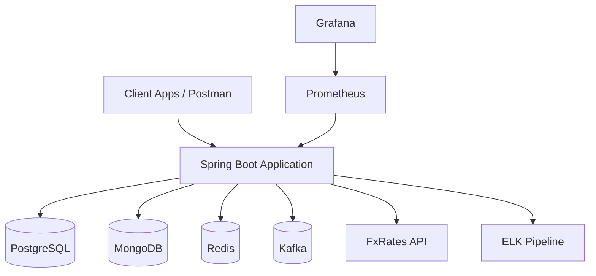
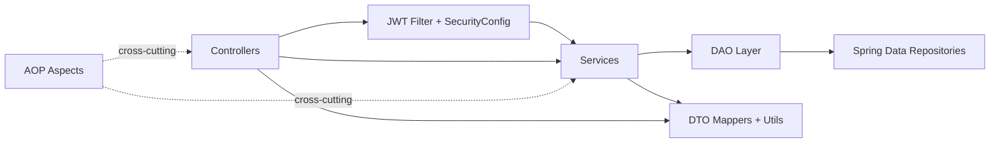
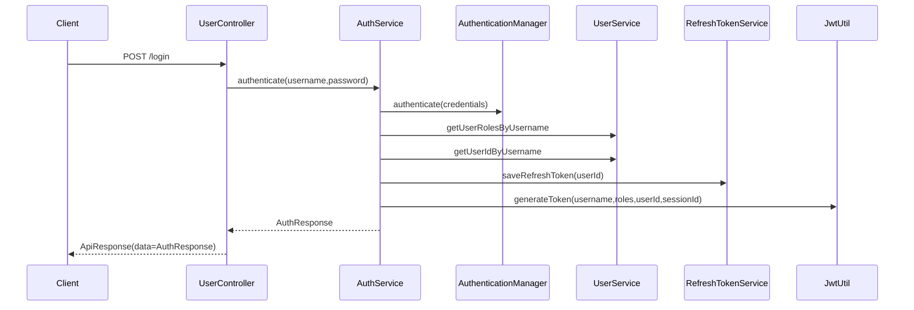
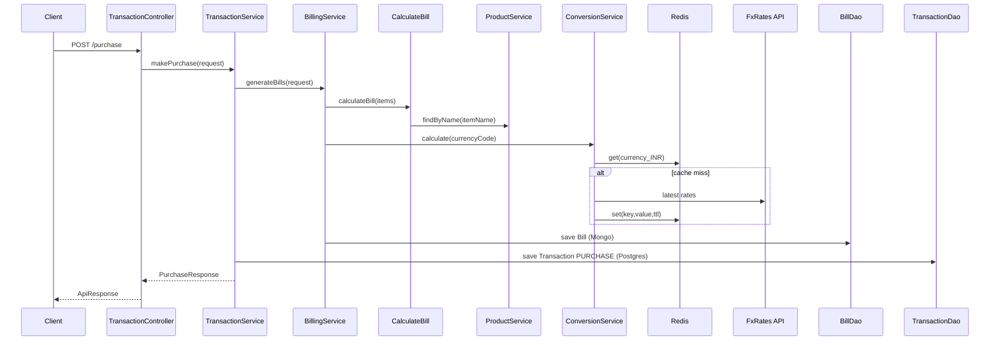
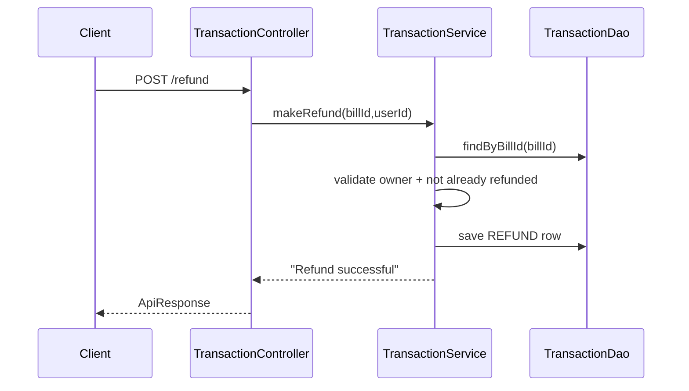
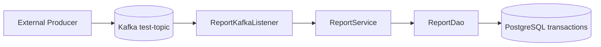
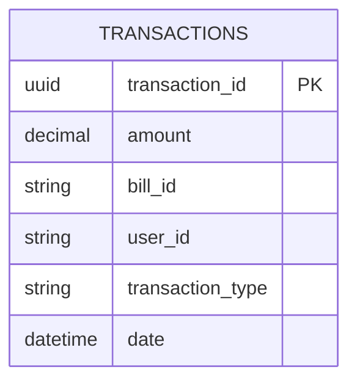
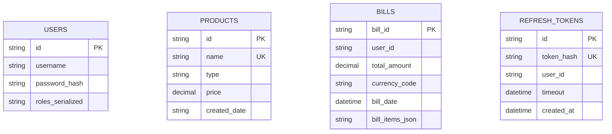

# Kirana Store Backend Architecture

## Contents
- [1. Document Purpose](#section-1)
- [2. System Context and Scope](#section-2)
- [3. High-Level Design (HLD)](#section-3)
- [4. Codebase Architecture (MVC + DAO + DTO)](#section-4)
- [5. API Contracts and Interface Design](#section-5)
- [6. Low-Level Design (LLD) Workflows](#section-6)
- [7. Datastore Design (PostgreSQL, MongoDB, Redis)](#section-7)
- [8. Transactionality, Atomicity, and Data Integrity](#section-8)
- [9. Caching Design and Invalidation](#section-9)
- [10. Rate Limiting Architecture](#section-10)
- [11. Distributed Locking Design](#section-11)
- [12. Security Architecture](#section-12)
- [13. OOP, SOLID, and Design Patterns](#section-13)
- [14. Maintainability and Error Handling](#section-14)
- [15. Observability (Metrics, Logging, Monitoring)](#section-15)
- [16. Testing Strategy (Mandatory)](#section-16)
- [17. Scalability, Bottlenecks, and Capacity Planning](#section-17)
- [18. Tradeoffs and Alternatives](#section-18)
- [19. Known Gaps and Prioritized Roadmap](#section-19)
- [20. Technical References](#section-20)

<a id="section-1"></a>
## 1. Document Purpose

This document explains:

- what the current implementation does,
- why the architecture is shaped this way,
- what to improve to make it production-grade.

It is written for two audiences:

- beginner backend engineers who need mental models and clear terminology,
- experienced engineers who want design depth, tradeoff analysis, and concrete improvement paths.

<a id="section-2"></a>
## 2. System Context and Scope

The system is a backend service for Kirana store transaction management.

Primary capabilities:

1. User registration and login.
2. JWT-based authorization for protected APIs.
3. Product catalog CRUD/read APIs.
4. Purchase bill creation and refund handling.
5. Currency conversion using an external FX API.
6. Report generation input through Kafka events.
7. Monitoring and operational telemetry.

Out-of-scope today:

- inventory decrement/replenishment workflows,
- payment gateway integration,
- accounting exports (GST, ledger files),
- admin backoffice UI.

<a id="section-3"></a>
## 3. High-Level Design (HLD)

### 3.1 Context Diagram



### 3.2 Component Decomposition



### 3.3 Deployment Topology (Docker Compose)

Current compose orchestrates:

- `spring-boot-app`,
- `postgres`, `mongodb`, `redis`,
- `kafka`,
- `prometheus`, `grafana`,
- optional ELK services (requires missing local config files to be added).

Operational note:

- app expects dependencies by container hostnames (`postgres`, `mongo`, `redis`, `kafka`) as defined in `application.properties`.

<a id="section-4"></a>
## 4. Codebase Architecture (MVC + DAO + DTO)

### 4.1 Layer Responsibilities

1. Controller Layer
   - Handles HTTP I/O only.
   - Extracts headers/tokens and delegates to services.
2. Service Layer
   - Owns business logic and orchestration.
   - Coordinates currency conversion, billing, persistence flow.
3. DAO Layer
   - Encapsulates access methods and pagination/query orchestration.
4. Repository Layer
   - Spring Data adapters to MongoDB/JPA.
5. DTO/Mapper Layer
   - Performs conversions across request models, response models, and entities.

### 4.2 Module Map

- `feature_users`: registration/authentication domain.
- `auth`: refresh token persistence and token refresh workflow.
- `feature_products`: product catalog domain.
- `feature_transactions`: purchase/refund/currency conversion domain.
- `feature_reports`: read/report domain over transaction ledger.
- `filters`, `config`, `AOP`: platform-level cross-cutting concerns.

### 4.3 Dependency Direction Rules

Recommended dependency direction:

- Controller -> Service Interface
- Service -> DAO Interface
- DAO -> Repository
- DTO Mapper is stateless helper

Current implementation mostly follows this, but some controllers/services directly inject concrete `*Imp` classes; replacing with interfaces improves testability and inversion of control.

<a id="section-5"></a>
## 5. API Contracts and Interface Design

### 5.1 Response Envelope

All endpoints currently use `ApiResponse`:

```json
{
  "success": true,
  "data": {},
  "status": "OK",
  "error": null,
  "errorMessage": null,
  "errorCode": null
}
```

### 5.2 Endpoint Inventory

| Endpoint | Method | Auth | Domain |
|---|---|---|---|
| `/register` | POST | Public | User |
| `/login` | POST | Public | User/Auth |
| `/generate-token` | GET | Access + Refresh headers | Auth |
| `/v1/api/products` | GET | Protected | Product |
| `/v1/api/products/type` | GET | Protected | Product |
| `/v1/api/products/add` | POST | ADMIN | Product |
| `/purchase` | POST | Protected | Transaction |
| `/refund` | POST | Protected | Transaction |

Important implementation note:

- `TransactionController` uses `@RestController("/v1/api")`, which sets bean name, not path mapping.
- Intended base route should be `@RequestMapping("/v1/api")`.

### 5.3 Contract Quality Recommendations

1. Adopt OpenAPI (`springdoc-openapi`) for generated, versioned API docs.
2. Return semantic HTTP status codes (`201`, `400`, `401`, `403`, `404`, `409`, `500`) instead of `200` for most failures.
3. Add strong request validation (`@NotBlank`, `@Size`, `@Pattern`, `@Valid`) and central error serialization.
4. Introduce idempotency headers for write operations:
   - `Idempotency-Key` for `/purchase`, `/refund`.

<a id="section-6"></a>
## 6. Low-Level Design (LLD) Workflows

### 6.1 Login and Token Issuance



### 6.2 Purchase Workflow



### 6.3 Refund Workflow



### 6.4 Report Generation Trigger



Current behavior prints computed report output to console. A production design should return report objects through dedicated APIs or publish report artifacts.

<a id="section-7"></a>
## 7. Datastore Design (PostgreSQL, MongoDB, Redis)

### 7.1 Why Two Primary Datastores

- PostgreSQL is used for transactional ledger rows (purchase/refund) requiring reliable date-range analytics.
- MongoDB stores flexible document aggregates:
  - users,
  - products,
  - bills (with embedded line items),
  - refresh tokens.

This is a classic polyglot persistence tradeoff: better model fit per domain at the cost of cross-store consistency complexity.

### 7.2 PostgreSQL Schema



Recommended indexes:

1. `idx_transactions_bill_id` on `bill_id`.
2. `idx_transactions_date` on `date`.
3. `idx_transactions_user_id_date` on `(user_id, date)`.

Expected query patterns:

- refund validation by `bill_id`,
- report query by date range,
- user-centric audit by `user_id`.

### 7.3 MongoDB Document Model

Current collections:

- `users`,
- `products`,
- `bills`,
- `refreshToken` (derived from `@Document` default naming for `RefreshToken`).

Mermaid-safe ER diagram (fixed syntax; no `[]` attribute types):



Mongo index recommendations:

1. `products.name` unique (already present).
2. `products.type` for filtered pagination.
3. `bills.userId` for user history and refunds.
4. `refreshToken.userId` and TTL or archival policy for expired sessions.

### 7.4 Redis Key Design

Current key usage:

- FX cache key: `<CURRENCY>_INR`
- value: conversion factor
- TTL: until end of current minute

Recommended keyspace conventions:

- `fx:v1:<currency>:inr` for conversion cache,
- `rate:v1:<principal>:<route>` for rate limiting tokens,
- `lock:v1:refund:<billId>` for distributed lock,
- `idem:v1:purchase:<idempotencyKey>` for duplicate request defense.

<a id="section-8"></a>
## 8. Transactionality, Atomicity, and Data Integrity

### 8.1 Current State

`@Transactional` is applied in transaction service methods, but write path spans two independent stores:

1. MongoDB bill write.
2. PostgreSQL transaction write.

There is no distributed transaction boundary across both stores in current design.

### 8.2 Failure Matrix

| Step | Failure point | Outcome |
|---|---|---|
| Bill save succeeds, transaction save fails | after Mongo write | orphan bill without ledger row |
| Bill save fails, transaction save not attempted | before Postgres write | no record; safe rollback-like behavior |
| Refund double-submit race | concurrent requests | duplicate refund rows unless guarded |

### 8.3 Recommended Integrity Patterns

1. Outbox + async projector:
   - write source-of-truth row + outbox event in one transaction,
   - project bill/read models asynchronously.
2. Saga orchestration:
   - explicit compensation if subsequent step fails.
3. Idempotency keys:
   - one client command maps to one durable business result.

<a id="section-9"></a>
## 9. Caching Design and Invalidation

### 9.1 Current Cache Strategy

- Read-through-like behavior in `ConversionServiceImp`.
- Cache miss triggers external FX API call.
- TTL aligned to minute granularity.

### 9.2 Why This Works

- FX rates are volatile but not per-millisecond.
- Minute-level refresh significantly reduces external API calls.

### 9.3 Risks and Mitigations

1. Stale rates around market movement:
   - include timestamp in response metadata.
2. Cache penetration (invalid currency):
   - cache negative lookups for short TTL.
3. Hot key contention:
   - use local tiny near-cache plus Redis if needed at larger scale.

<a id="section-10"></a>
## 10. Rate Limiting Architecture

### 10.1 Current Implementation

1. Global request filter bucket:
   - single in-memory bucket around 100 req/min.
2. AOP per-method bucket:
   - in-memory limits by annotated method (`@RateLimiter(limit = X)`).

### 10.2 Gaps

- not distributed across multiple instances,
- no tenant/user/IP-specific fairness globally,
- no response headers (`X-RateLimit-*`, `Retry-After`) to help clients backoff.

### 10.3 Production Blueprint

Distributed token-bucket with Redis:

1. derive principal key (`userId` or client IP),
2. derive route key (`POST:/purchase`),
3. consume token atomically in Redis,
4. return standardized 429 response with retry metadata.

<a id="section-11"></a>
## 11. Distributed Locking Design

### 11.1 Why Locking Is Needed

Use locks for race-prone critical sections:

- refund on same `billId`,
- purchase retried concurrently with same idempotency key.

### 11.2 Correct Redis Lock Semantics

Acquire:

1. generate owner token UUID,
2. `SET lockKey ownerToken NX PX <leaseMs>`.

Release:

1. Lua script compare-and-delete:
   - delete only if stored token equals owner token.

### 11.3 Safety Considerations

- lock lease must exceed worst-case critical section runtime,
- refresh lease for long operations (watchdog),
- never unlock blindly.

<a id="section-12"></a>
## 12. Security Architecture

### 12.1 Current Security Flow

1. User logs in with credentials.
2. Spring Security authenticates user against Mongo user store (`CustomUserDetailsService`).
3. JWT contains:
   - `roles`,
   - `userId`,
   - `sessionId`.
4. `JwtFilter` validates and loads authorities.
5. `@PreAuthorize` enforces role checks for specific endpoints.

### 12.2 Security Risk Review

1. Refresh token verification currently hashes and compares incorrectly.
   - must use `BCryptPasswordEncoder.matches(raw, storedHash)`.
2. Secret key is hardcoded.
   - move to environment variable or secret manager.
3. Very short token expiration may be good for security, but refresh path must be robust.
4. Error messages should avoid leaking security-sensitive internals.

### 12.3 Hardening Checklist

1. Rotate JWT secret regularly.
2. Add token revocation strategy by session/version.
3. Add login brute-force protections.
4. Add audit logs for auth events.
5. Consider refresh-token rotation per use.

<a id="section-13"></a>
## 13. OOP, SOLID, and Design Patterns

### 13.1 OOP Usage in Current Code

- Encapsulation:
  - domain data encapsulated in entity/model classes.
- Abstraction:
  - service and repository interfaces abstract implementation details.
- Polymorphism:
  - interface-driven service contracts (`AuthService`, `ProductService`, etc.).

### 13.2 Design Patterns Applied

1. DAO pattern.
2. DTO + Mapper pattern.
3. Dependency Injection pattern (Spring container).
4. AOP pattern for cross-cutting concerns.
5. Repository pattern via Spring Data.

### 13.3 SOLID Deep Dive

1. Single Responsibility:
   - good packaging by feature domains.
2. Open/Closed:
   - service interfaces allow extension without changing callers.
3. Liskov:
   - implementations generally preserve interface contracts.
4. Interface Segregation:
   - interfaces are reasonably focused.
5. Dependency Inversion:
   - partially achieved; improve by injecting interfaces end-to-end.

<a id="section-14"></a>
## 14. Maintainability and Error Handling

### 14.1 Maintainability Standards

1. Keep controllers thin and declarative.
2. Keep service methods cohesive and deterministic.
3. Keep DAO methods focused on persistence concerns.
4. Use descriptive naming for domain intent.
5. Keep mapping logic out of controllers.

### 14.2 Custom Exception Strategy

Recommended exception taxonomy:

- `ValidationException` (client input),
- `DomainRuleViolationException` (business rule conflicts),
- `NotFoundException`,
- `AuthenticationException`,
- `AuthorizationException`,
- `IntegrationException` (external dependency failures).

Map these to stable API errors:

- code (`TXN_409_ALREADY_REFUNDED`),
- message (human-readable),
- httpStatus,
- traceId.

### 14.3 Logging Guidance

Use structured logs with stable fields:

- `traceId`, `spanId`, `userId`, `billId`, `endpoint`, `status`, `latencyMs`.

Do not log secrets:

- passwords,
- tokens,
- raw authorization headers.

<a id="section-15"></a>
## 15. Observability (Metrics, Logging, Monitoring)

### 15.1 Metrics

Current stack:

- Spring Actuator + Micrometer + Prometheus.

High-value custom metrics to add:

1. `purchase_requests_total{status=...}`
2. `refund_requests_total{status=...}`
3. `fx_cache_hit_ratio`
4. `fx_api_latency_ms`
5. `rate_limit_rejections_total`
6. `kafka_report_events_total`

### 15.2 Logging

Current code logs via standard Spring logging and can route to ELK using logstash encoder dependencies.

Add:

- log correlation IDs,
- error classification codes,
- consistent JSON log format for parsing and dashboards.

### 15.3 Alerting

Recommended initial alerts:

1. API 5xx error rate > threshold.
2. FX API failure burst.
3. Cache hit ratio drop.
4. Kafka consumer lag increase.
5. DB connection pool saturation.

<a id="section-16"></a>
## 16. Testing Strategy (Mandatory)

Current repository has no `src/test` coverage yet.

### 16.1 Test Pyramid

1. Unit tests (majority):
   - service rules, mapper behavior, utility methods.
2. Integration tests:
   - repository/DAO with real containers.
3. API tests:
   - endpoint behavior, auth flows, error semantics.
4. Contract tests:
   - request/response compatibility.

### 16.2 Unit Test Targets

Mandatory method-level tests:

1. `TransactionServiceImpl.makePurchase`
2. `TransactionServiceImpl.makeRefund`
3. `BillingServiceImp.generateBills`
4. `ConversionServiceImp.calculate`
5. `AuthServiceImp.authenticate`
6. `RefreshTokenServiceImp.generateAccessToken`

### 16.3 Integration Test Targets

Use Testcontainers for:

- PostgreSQL,
- MongoDB,
- Redis,
- Kafka (for report listener flow).

### 16.4 Quality Gates

1. Block merge on failed tests.
2. Enforce minimum line/branch coverage for critical packages.
3. Run static analysis and formatting checks in CI.

<a id="section-17"></a>
## 17. Scalability, Bottlenecks, and Capacity Planning

### 17.1 Current Bottlenecks

1. In-memory rate limits do not scale horizontally.
2. FX API call path can become latency bottleneck on cache miss.
3. Cross-store writes risk consistency gaps.
4. Report path depends on Kafka input and currently has no report persistence/output API.

### 17.2 Scale Plan

1. Externalize rate limit + lock state to Redis.
2. Add idempotency for write APIs.
3. Add resilience patterns:
   - retry with jitter,
   - timeout,
   - circuit breaker.
4. Add async projections for analytics/reporting.
5. Add DB index tuning and query plans for top paths.

### 17.3 Capacity Signals to Track

- requests per second,
- p95/p99 latency by endpoint,
- DB slow query count,
- Redis command latency,
- Kafka lag,
- JVM heap and GC pause.

<a id="section-18"></a>
## 18. Tradeoffs and Alternatives

### 18.1 SQL vs NoSQL

Chosen approach:

- SQL for immutable ledger-style analytics,
- NoSQL for aggregate documents with evolving shape.

Alternative:

- single PostgreSQL model with JSONB for flexible documents.

Tradeoff:

- simpler consistency model vs reduced model flexibility.

### 18.2 Eventing

Current:

- Kafka used for report trigger consumption.

Alternative:

- schedule-based reporting jobs (cron) for simpler operations.

Tradeoff:

- event-driven flexibility vs operational complexity.

### 18.3 Security Session Model

Current:

- JWT + refresh token storage in Mongo.

Alternative:

- opaque session tokens in Redis with strict revocation controls.

Tradeoff:

- stateless request auth vs centralized session control.

<a id="section-19"></a>
## 19. Known Gaps and Prioritized Roadmap

Priority 0 (correctness/security):

1. Fix refresh token hash verification using `matches`.
2. Correct transaction base path mapping to `/v1/api`.
3. Standardize HTTP status/error semantics.

Priority 1 (resilience/consistency):

1. Add idempotency keys to write APIs.
2. Add distributed locking for refund path.
3. Move rate limiting to Redis-backed distributed policy.

Priority 2 (engineering excellence):

1. Add complete unit + integration + API test suite.
2. Add OpenAPI generation and examples.
3. Add richer observability and alerting dashboards.

Priority 3 (feature maturity):

1. Add report APIs and persisted report outputs.
2. Add inventory stock tracking integration.
3. Add audit trails and compliance exports.

<a id="section-20"></a>
## 20. Technical References

- Spring Boot reference:
  - https://docs.spring.io/spring-boot/docs/current/reference/html/
- Spring Security:
  - https://docs.spring.io/spring-security/reference/
- Spring Data JPA:
  - https://docs.spring.io/spring-data/jpa/reference/
- Spring Data MongoDB:
  - https://docs.spring.io/spring-data/mongodb/reference/
- Spring Data Redis:
  - https://docs.spring.io/spring-data/redis/reference/
- Spring Kafka:
  - https://docs.spring.io/spring-kafka/reference/
- PostgreSQL docs:
  - https://www.postgresql.org/docs/
- MongoDB docs:
  - https://www.mongodb.com/docs/
- Redis docs:
  - https://redis.io/docs/latest/
- Bucket4j:
  - https://bucket4j.com/
- Micrometer:
  - https://micrometer.io/docs
- Prometheus:
  - https://prometheus.io/docs/introduction/overview/
- Grafana:
  - https://grafana.com/docs/
- JWT:
  - https://jwt.io/introduction
